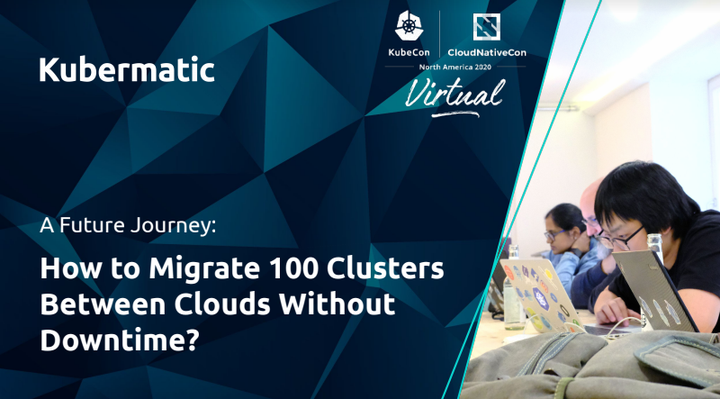

# Kubermatic Cluster Migration

## Overview

Based on the KubeCon Talk ["A future journey - How to Migrate 100 Clusters between Clouds without Downtime?"](https://kccncna20.sched.com/event/b806ba46a5cdefbb45b444652d7d15d1) the respository contains the current state of the cluster migration scripts.

Currently the scripts are available for the [user cluster](./user-cluster) migration. The workflow used for migration of a master/seed cluster based on kubeone is still WIP.

## More information

For more information, take a look to the recording or the slide deck:

## Troubleshooting

If you encounter issues [file an issue][1] or talk to us on the [#kubermatic channel][12] on the [Kubermatic Slack][15].

## Contributing

Thanks for taking the time to join our community and start contributing!

Feedback and discussion are available on [#kubermatic channel][12].

### Before you start

* Please familiarize yourself with the [Code of Conduct][4] before contributing.
* See [CONTRIBUTING.md][2] for instructions on the developer certificate of origin that we require.

### Pull requests

* We welcome pull requests. Feel free to dig through the [issues][1] and jump in.

## Changelog

- Initial set of cluster migration scripts for KKP user clusters (vSphere -> AWS) 

[1]: https://github.com/kubermatic-labs/cluster-migration/issues
[2]: https://github.com/kubermatic-labs/cluster-migration/blob/master/CONTRIBUTING.md
[3]: https://github.com/kubermatic-labs/cluster-migration/releases
[4]: https://github.com/kubermatic-labs/cluster-migration/blob/master/CODE_OF_CONDUCT.md

[12]: https://kubermatic.slack.com/messages/kubermatic
[15]: http://slack.kubermatic.io/